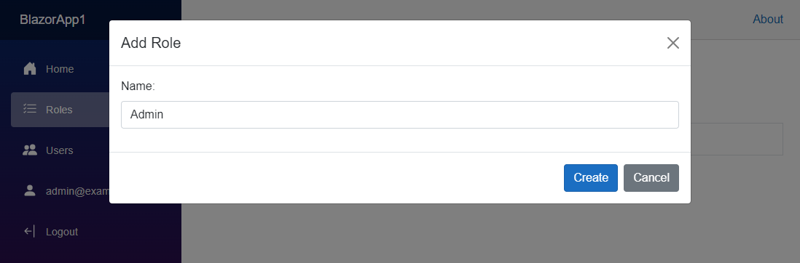
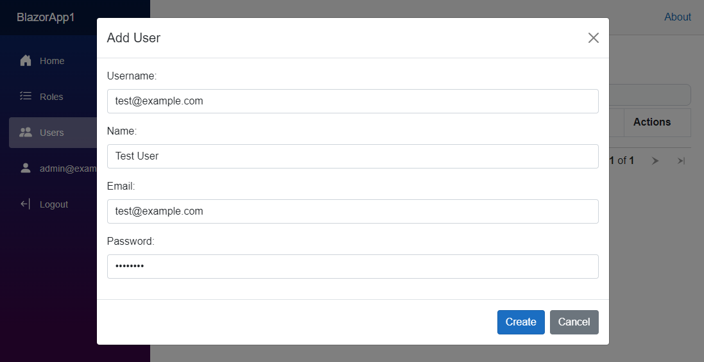
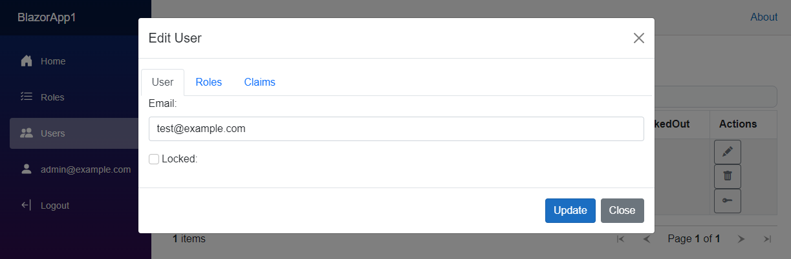
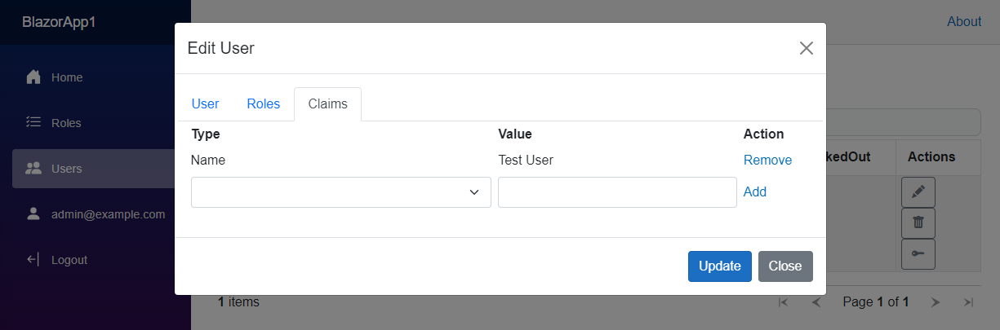

# Identity Manager Blazor United
Identity management system for [ASP.NET Core Identity](https://github.com/aspnet/AspNetCore/tree/master/src/Identity) for use with ASP.NET Core 8 and developed with [Blazor United](https://learn.microsoft.com/en-us/aspnet/core/blazor/?view=aspnetcore-8.0#build-a-full-stack-web-app-with-blazor) to supersede the following projects:

* [Identity Manager](https://github.com/mguinness/IdentityManager) - ASP.NET Core 1, 2
* [Identity Manager UI](https://github.com/mguinness/IdentityManagerUI) - ASP.NET Core 3, 5, 6
* [Identity Manager Blazor](https://github.com/mguinness/IdentityManagerBlazor) - ASP.NET Core 7

## Introduction
When creating a new Blazor Web App you have the option to change the authentication type to individual accounts to include the identity system into your project. This includes registration, login and several pages related to user account self management like 2FA and password reset.

The missing piece to the puzzle is user management for the site. For ASP.NET membership there was [ASP.NET Website Administration Tool (WSAT)](https://docs.microsoft.com/en-us/aspnet/web-forms/overview/older-versions-getting-started/deploying-web-site-projects/users-and-roles-on-the-production-website-cs) and for ASP.NET Identity there was [Identity Manager](http://brockallen.com/2014/04/09/introducing-thinktecture-identitymanager/) by Brock Allen.  AFAIK there is no solution available for ASP.NET Core Identity so this repo is an effort to remedy that.

## Integration

When creating a project choose the Blazor Web App template and select the Individual Accounts authentication type and WebAssembly for Interactive render mode.

### Server Project

In `ApplicationUser` you need to add the following properties.

```CSharp
public class ApplicationUser : IdentityUser
{
    public ICollection<IdentityUserRole<string>> Roles { get; set; }
    public ICollection<IdentityUserClaim<string>> Claims { get; set; }
}
```

Similarily after creating `ApplicationRole` you need to add a property.

```CSharp
public class ApplicationRole : IdentityRole
{
    public ICollection<IdentityRoleClaim<string>> Claims { get; set; }
}
```

In `Program` you will have to include references to `ApplicationUser` and `ApplicationRole` that were added to the project.

```CSharp
builder.Services.AddIdentityCore<ApplicationUser>(options =>
    {
        options.SignIn.RequireConfirmedAccount = true;
    })
    .AddRoles<ApplicationRole>()
    .AddEntityFrameworkStores<ApplicationDbContext>();
```

In your `ApplicationDbContext` you need to define the following navigation properties.

```CSharp
public class ApplicationDbContext(DbContextOptions<ApplicationDbContext> options) : IdentityDbContext<ApplicationUser, ApplicationRole, string>(options)
{
    protected override void OnModelCreating(ModelBuilder builder)
    {
        base.OnModelCreating(builder);

        builder.Entity<ApplicationUser>().HasMany(p => p.Roles).WithOne().HasForeignKey(p => p.UserId).IsRequired().OnDelete(DeleteBehavior.Cascade);
        builder.Entity<ApplicationUser>().HasMany(e => e.Claims).WithOne().HasForeignKey(e => e.UserId).IsRequired().OnDelete(DeleteBehavior.Cascade);
        builder.Entity<ApplicationRole>().HasMany(r => r.Claims).WithOne().HasForeignKey(r => r.RoleId).IsRequired().OnDelete(DeleteBehavior.Cascade);
    }
}
```

After adding `IdentityController` you will need to add the following to `Program`.

```CSharp
builder.Services.AddControllers();
...
app.MapControllers();
```

### Client Project

Add the following package references to the project:

`Microsoft.Extensions.Http`
`Microsoft.AspNetCore.Components.QuickGrid`

You will also need to add the following to `Program`:

```CSharp
builder.Services.AddHttpClient("WebAPI", client => client.BaseAddress = new Uri(builder.HostEnvironment.BaseAddress));
builder.Services.AddScoped(sp => sp.GetRequiredService<IHttpClientFactory>().CreateClient("WebAPI"));
```

In addition add the following components to the project:

`Modal.razor`
`Roles.razor`
`Users.razor`

## Setup
As the example project uses [FileBaseContext](https://github.com/dualbios/FileBaseContext) as the database provider there is no database setup needed since the ASP.NET Identity Core tables are stored in files, however for your own project you should use a [Database Provider](https://docs.microsoft.com/en-us/ef/core/providers/) to store these.

Run the project and you will be able to use the website to manage users, roles and claims.  With the provided Identity tables stored as files you can login as admin@example.com with "Password".

## Features
The first thing that you will likely do is create a new administrator role to manage additional users.



Once done you can create a new user by providing basic information like username and password.



After the user has been created you can then edit email address and lock account if required. 



In the user edit dialog you can select the Roles tab to assign user to previously defined roles.


In addition you can also select the Claims tab to add or remove claims to the user being edited.

